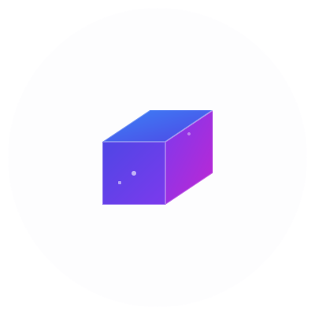

#  3D Model Hub

<!-- Add GitHub Actions workflow badge here once set up -->
<!--  -->

**An advanced, web-based 3D model viewer with a focus on high-quality rendering, extensive customization, and a smooth user experience. Built with Three.js.**

---

3D Model Hub allows you to easily upload, view, and customize 3D models directly in your browser. Whether you\'re a 3D artist, game developer, or just want to explore 3D assets, this tool provides a rich set of features to inspect and present your models beautifully.

## ✨ Key Features

- **Model Loading:**
  - Supports `.glb` and `.gltf` file formats.
  - Drag & drop or click to upload.
- **High-Quality Rendering:**
  - Physically-based rendering (PBR).
  - ACES Filmic tone mapping.
  - Procedural studio environment map for realistic reflections.
  - Custom HDRI (`.hdr`) environment loading.
- **Advanced Lighting Control:**
  - Adjust ambient, key (directional/spot), and hemisphere lights (intensity and color).
  - Sophisticated multi-light setup for rich scenes.
- **Scene Customization:**
  - Control scene background color (with fog matching).
  - Control floor color and appearance.
- **Shadow Configuration:**
  - Adjust shadow map size, bias, and radius for the key light.
- **Post-Processing Effects:**
  - **Bloom (UnrealBloomPass):** Toggle and fine-tune threshold, strength, and radius.
  - **Screen Space Ambient Occlusion (SSAOPass):** Toggle and control kernel radius, min/max distance.
  - **Anti-Aliasing (SMAAPass):** Toggle for smoother edges.
- **Camera Controls:**
  - Orbit, pan, and zoom.
  - Adjustable camera distance.
  - Auto-rotation toggle with adjustable speed.
  - Reset view to default.
- **Interactive UI:**
  - Clean, organized accordion-style control panel.
  - Real-time updates as you adjust settings.
  - Model information display (name, scaled size).
- **Export:**
  - Export the current scene view as a PNG image.
- **Responsive Design:** Adapts to different screen sizes.

## 📸 Screenshots

_(Add your screenshots here. Good ideas include: the landing page, the viewer with a model loaded, the control panel open, a close-up showcasing a post-processing effect.)_

**Example:**

## 🛠️ Technology Stack

- **Core:** [Three.js](https://threejs.org/) (r150+)
- **Language:** JavaScript (ES6 Modules)
- **Styling:** HTML5 & CSS3
- **No external framework dependencies for the core viewer logic.**

## 🚀 Getting Started / How to Use

1.  **Visit the Live Demo:** [Link to Live Demo](#) <!-- Update this link -->
2.  **Load a Model:**
    - Drag and drop a `.glb` or `.gltf` file onto the upload zone.
    - Alternatively, click the upload zone to open a file dialog.
3.  **Navigate:**
    - **Orbit:** Left-click and drag.
    - **Zoom:** Mouse scroll wheel.
    - **Pan:** Right-click and drag (or Middle-click and drag, depending on OrbitControls configuration).
4.  **Customize:**
    - Use the control panel on the right to adjust lighting, environment, post-processing effects, and more. Changes are applied in real-time.
5.  **Upload Custom Environment:**
    - Use the "Upload HDRI" button in the "Environment" section to load your own `.hdr` environment maps.
6.  **Export:**
    - Click the "Export Scene as PNG" button to download an image of the current view.
7.  **New Upload:**
    - Click the "New Upload" button to return to the landing page and load a different model.

## 🔮 Future Roadmap (Ideas Under Consideration)

We aim to make 3D Model Hub the best online viewer! Some features we\'re thinking about:

- **Enhanced Environment Options:**
  - Procedural skybox generation (time of day, weather).
  - More ground plane options (toggle visibility, size, textures, reflectivity).
- **Additional Lighting Tools:**
  - Predefined light presets (e.g., "Product Shot," "Dramatic").
- **User Experience (UX) & UI Polish:**
  - Continuous UI/UX refinement.
  - Performance optimizations for even larger models.
  - Contextual help and tooltips.
- **Wider File Format Support:** (e.g., FBX, OBJ)
- **Advanced Material Editor.**
- **Animation Controls.**
- And much more!

## 🤝 Contributing

Currently, this project is primarily developed by [rahuldkjain](https://github.com/rahuldkjain). As the project matures, contribution guidelines will be established. In the meantime, feel free to open issues for bugs or feature requests!

## 📜 License

This project is licensed under the MIT License - see the [LICENSE.md](LICENSE.md) file for details.

---
